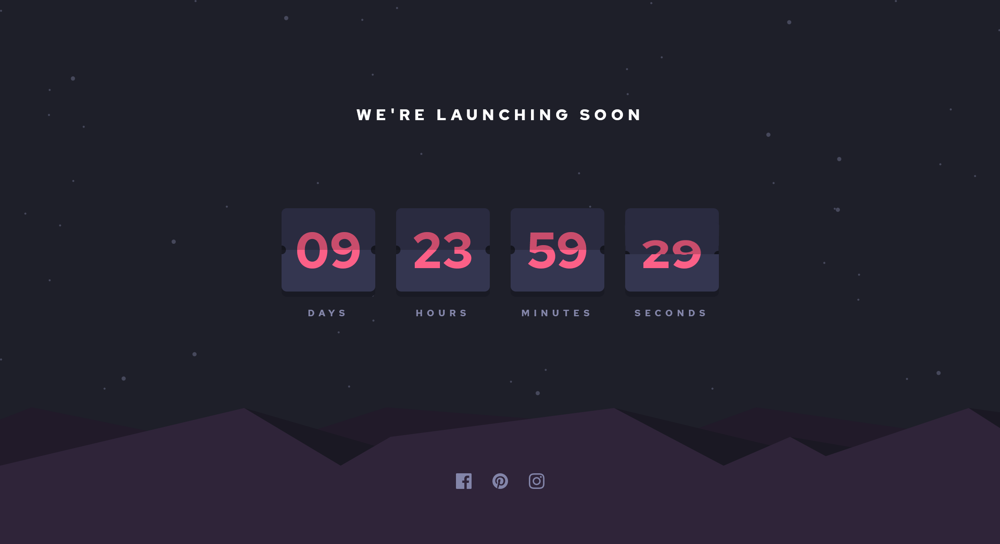

# Frontend Mentor - Launch countdown timer solution

This is a solution to the [Launch countdown timer challenge on Frontend Mentor](https://www.frontendmentor.io/challenges/launch-countdown-timer-N0XkGfyz-). Frontend Mentor challenges help you improve your coding skills by building realistic projects. 

## Table of contents

- [Overview](#overview)
  - [The challenge](#the-challenge)
  - [Screenshot](#screenshot)
  - [Links](#links)
- [My process](#my-process)
  - [Built with](#built-with)
  - [What I learned](#what-i-learned)
  - [Continued development](#continued-development)
  - [Useful resources](#useful-resources)
- [Author](#author)

**Note: Delete this note and update the table of contents based on what sections you keep.**

## Overview

### The challenge

Users should be able to:

- See hover states for all interactive elements on the page
- See a live countdown timer that ticks down every second (start the count at 14 days)
- **Bonus**: When a number changes, make the card flip from the middle

### Screenshot

### Links

- Solution URL: [https://www.frontendmentor.io/solutions/countdown-with-sass-js-and-css-transitions-MhJPr26_A](https://www.frontendmentor.io/solutions/countdown-with-sass-js-and-css-transitions-MhJPr26_A)
- Live Site URL: [https://jovial-davinci-7603fe.netlify.app/](https://jovial-davinci-7603fe.netlify.app/)

## My process

### Built with

- HTML5
- Flexbox
- CSS Grid
- Sass
- JavaScript

### What I learned

This was a big one for learning how to use transitions as well as creating flippable elements. I still have a ways to go with it, but I'm happy with my first shot at this flipcard animation. Also picked up a few nuances with JS with setInterval and setTimeout which will come in handy on future projects.

### Continued development

I hope to get better at transitions in further projects. I also wish to come back to this one and maybe trying to get the flip animation a bit better with animations instead.

### Useful resources

- [https://www.w3schools.com/howto/howto_js_countdown.asp](https://www.w3schools.com/howto/howto_js_countdown.asp) - Helpful for coding a countdown timer with js.

- [https://codepen.io/wdmg/pen/XqNPEp](https://codepen.io/wdmg/pen/XqNPEp) - Helped me solve some problems with applying the css transitions in JS.

## Author

- Frontend Mentor - [@mattyd96](https://www.frontendmentor.io/profile/mattyd96)